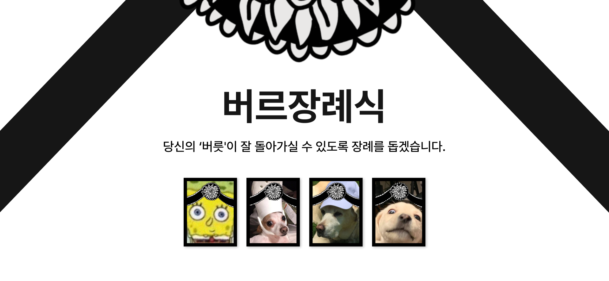

# 프로젝트명 : 버르장례식

## 프로젝트 소개

내가 버리고 싶은 버릇과 모습에 대한 장례식을 치룰 수 있는 서비스이다. 이를 통해서 과거의 나와 ‘Disconnect’하고 미래의 나와 ‘Connect’ 할 수 있는 기회를 제공한니다. 또한, 나의 새로운 출발을 위해 나를 지원해 줄 지인들을 ‘Connect’해준다.

 

## 핵심 기능 소개

### <a href = "https://github.com/2nd-PARD-WEB-PART/PARD-2th-Memorial/blob/main/memorial-frontend/src/pages/Login.js">Login 기능</a>

: 구글 파이어베이스를 연동하여 기존 스프링부트 서버와는 별개로 Google 계정으로 로그인할 수 있다. 또한, 로그인 세션을 로컬스토지와 함께 사용하여 로그인 상태를 유지할 수 있다.

### <a href = "https://github.com/2nd-PARD-WEB-PART/PARD-2th-Memorial/blob/main/memorial-frontend/src/pages/AddPage.js">장례식 추가 및 조회 기능</a>

: Axios 기능을 활용하여 백엔드에서 지원하는 API를 활용하여 데이터를 추가하고 조회할 수 있다. 또한, 수정 및 삭제에 대해서고 고려 중이다.

### <a href = "https://github.com/2nd-PARD-WEB-PART/PARD-2th-Memorial/blob/main/memorial-frontend/src/pages/ViewPage.js">댓글 기능</a>

: 등록된 장례식 (하나의 게시물)에 여러 댓글을 달 수 있으며, 로그인이 필요하지 않다.
 

## 팀원 정보

### 개발자

| 종류 | 
내용
 | 
내용
 | 
내용
 | 
내용
 |
| :--: | :--------------------------------: | :--------------------------------: | :--------------------------------: | :--------------------------------: |
| Name |               김광일               |               김현중               |               박주영               |               서하민               |
| PART |                WEB                 |                WEB                 |                WEB                 |               SERVER               |
| Age  |                 23                 |                 25                 |                 26                 |                 20                 |

### 디자이너 & 기획자

| 종류 | 
내용
 | 
내용
 | 
내용
 |
| :--: | :--------------------------------: | :--------------------------------: | :--------------------------------: |
| Name |               김현지               |               이하영               |               전예람               |
| PART |                WEB                 |                WEB                 |                WEB                 |
| Age  |                 24                 |                 22                 |                 28                 |

 

## Built With

